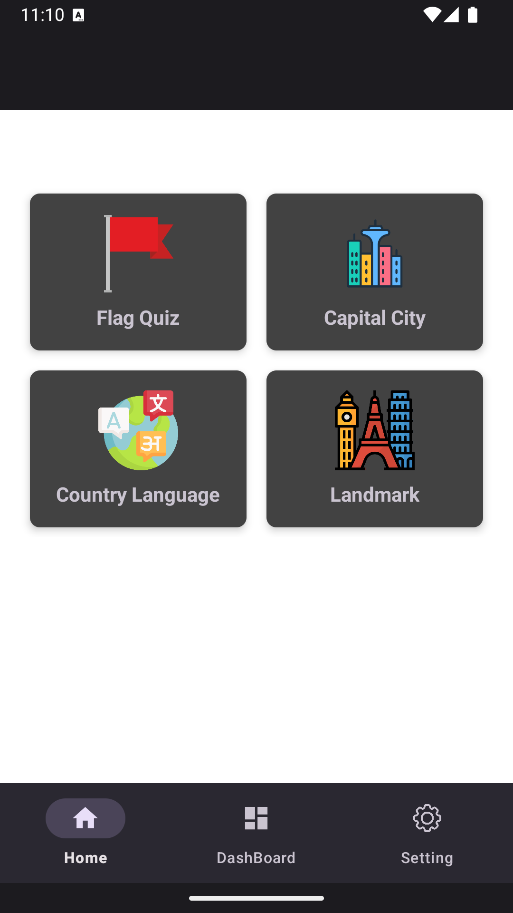
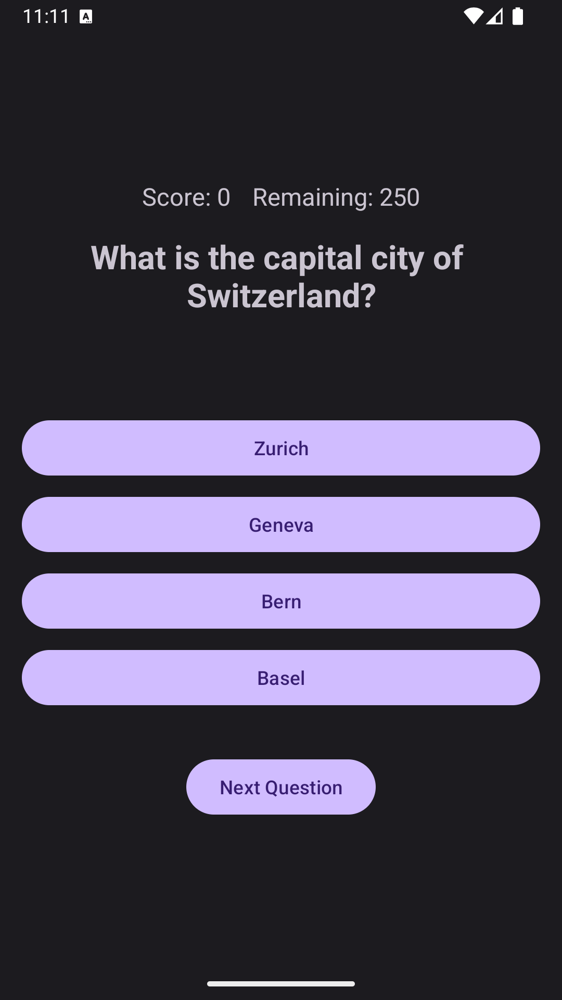
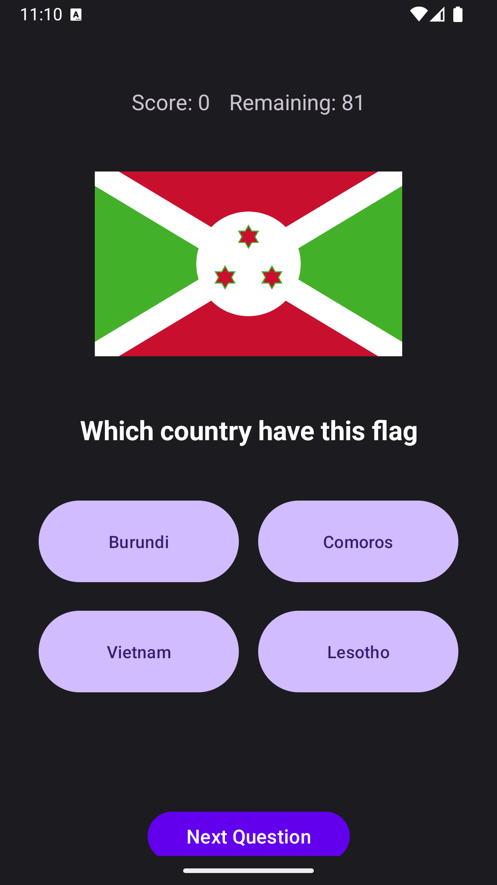

# 🌍 Geography Quiz Game

A fun and educational Android app that challenges users to test and improve their knowledge of world geography, from countries and capitals to landmarks and flags.

## 📱 Screenshots

| Home Screen | Quiz Screen | Result Screen |
|-------------|-------------|----------------|
|  |  |  |

---

## 🚀 Features

-  Multiple categories: Countries, Capitals, Flags, and Landmarks  
-  Option tailor to the correct option
-  Multiple Language

---

## 🛠️ Tech Stack

- **Language**: Java  
- **Framework**: Android SDK  
- **UI**: XML Layouts, Material Design  
- **Database**: SQLite  
- **IDE**: IntelliJ (Android Studio)

---
